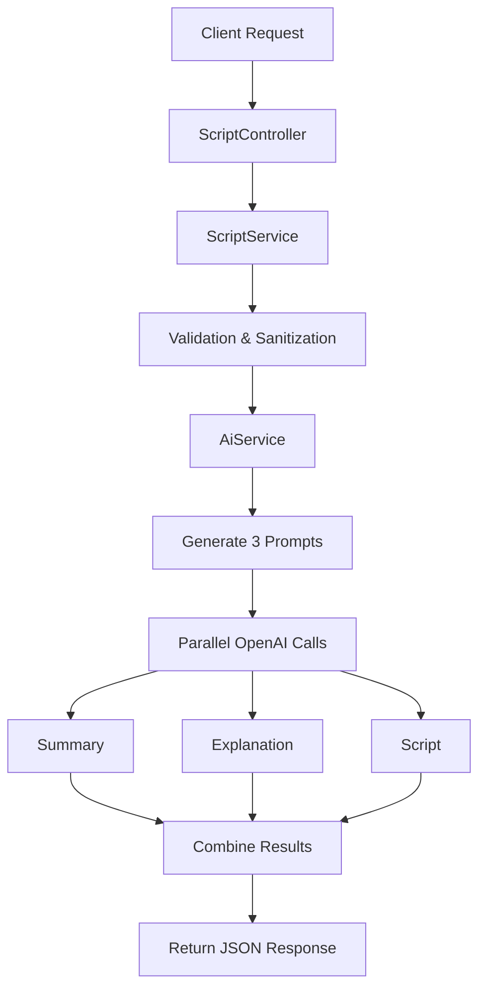

# TopicScriptor - Project Overview

## 🎯 Project Summary

TopicScriptor is a full-featured NestJS application that leverages OpenAI (or compatible APIs like Grok) to generate three types of content for any given topic:

1. **Summary** - Well-structured, citation-worthy content with key insights
2. **Explanation** - Simple, conversational explanation for general audiences  
3. **Script** - Engaging podcast/YouTube script with entertainment value

## 📁 Complete File Structure

```
TopicScriptor/
├── src/
│   ├── ai/
│   │   ├── ai.module.ts              # AI module configuration
│   │   └── ai.service.ts             # OpenAI integration service
│   ├── config/
│   │   └── config.service.ts         # Configuration management
│   ├── dto/
│   │   └── create-script.dto.ts      # Data transfer objects & validation
│   ├── script/
│   │   ├── script.module.ts          # Script module configuration
│   │   ├── script.controller.ts      # REST API endpoints
│   │   └── script.service.ts         # Business logic service
│   ├── utils/
│   │   └── openai.prompts.ts         # AI prompt templates
│   ├── app.module.ts                 # Main application module
│   └── main.ts                       # Application entry point
├── test/
│   ├── app.e2e-spec.ts              # End-to-end tests
│   └── jest-e2e.json                # Test configuration
├── examples/
│   ├── sample-request.js            # Client testing script
│   └── sample-responses.json        # Example API responses
├── scripts/
│   ├── setup.sh                     # Unix setup script
│   └── setup.bat                    # Windows setup script
├── package.json                     # Dependencies & scripts
├── nest-cli.json                    # NestJS CLI configuration
├── tsconfig.json                    # TypeScript configuration
├── .env.example                     # Environment template
├── README.md                        # Comprehensive documentation
└── PROJECT_OVERVIEW.md              # This file
```

## 🔄 Application Flow



## 🛠️ Architecture Components

### 1. **Entry Point (`main.ts`)**
- Bootstraps NestJS application
- Configures global validation pipes
- Enables CORS for frontend integration
- Sets up port and logging

### 2. **App Module (`app.module.ts`)**
- Imports ConfigModule for environment management
- Registers ScriptModule and AiModule
- Provides global configuration service

### 3. **Script Module** 
- **Controller**: Handles HTTP requests/responses
- **Service**: Implements business logic and validation
- **DTO**: Defines data structure and validation rules

### 4. **AI Module**
- **Service**: Manages OpenAI integration
- Handles parallel API calls for efficiency
- Configurable for different AI providers

### 5. **Configuration**
- Environment-based configuration
- Secure API key management
- Development/production modes

### 6. **Utilities**
- Prompt templates for consistent AI responses
- Type-safe prompt management
- Customizable content generation

## 🔧 Key Features Implemented

### ✅ **Robust Input Validation**
- String length validation (3-500 characters)
- Type checking and sanitization
- XSS protection through character filtering
- Comprehensive error handling

### ✅ **Parallel AI Processing**
- Simultaneous generation of all three content types
- Optimized for performance and cost efficiency
- Error handling for individual request failures

### ✅ **Flexible AI Integration**
- OpenAI GPT models support
- Compatible with Grok and other OpenAI-compatible APIs
- Configurable model parameters (temperature, tokens, etc.)

### ✅ **Professional API Design**
- RESTful endpoint structure
- Consistent JSON response format
- Proper HTTP status codes
- CORS support for frontend integration

### ✅ **Comprehensive Testing**
- E2E tests for all endpoints
- Validation testing
- Error handling verification
- Performance testing with timeouts

### ✅ **Production Ready**
- Environment-based configuration
- Structured logging
- Error handling and recovery
- Docker-ready structure

## 🎨 Prompt Engineering

The application uses sophisticated prompt engineering to generate different content styles:

### Summary Prompt
- Focuses on factual, structured information
- Emphasizes key statistics and insights
- Citation-worthy tone and format
- Markdown formatting for readability

### Explanation Prompt  
- Conversational and accessible tone
- Uses analogies and real-world examples
- Avoids technical jargon
- Educational focus for general audiences

### Script Prompt
- Entertainment-focused approach
- Includes engagement hooks and transitions
- Natural speaking patterns with pause markers
- Call-to-action elements for audience interaction

## 📊 API Specification

### Endpoint: `POST /generate-script`

**Request:**
```json
{
  "topic": "string (3-500 characters)"
}
```

**Response:**
```json
{
  "summary": "string (markdown formatted)",
  "explanation": "string (conversational)",
  "script": "string (entertainment format)"
}
```

**Error Responses:**
- `400`: Validation errors (topic too short/long, missing, etc.)
- `500`: Server errors (AI service failures, configuration issues)

## 🚀 Quick Start

1. **Setup Environment:**
   ```bash
   npm install
   cp .env.example .env
   # Edit .env with your OpenAI API key
   ```

2. **Start Development:**
   ```bash
   npm run start:dev
   ```

3. **Test API:**
   ```bash
   curl -X POST http://localhost:3000/generate-script \
     -H "Content-Type: application/json" \
     -d '{"topic": "History of space exploration"}'
   ```

4. **Run Tests:**
   ```bash
   npm run test:e2e
   ```

## 🔮 Extension Possibilities

The current architecture supports easy extensions:

- **Additional Content Types**: Add new prompt templates and response fields
- **Multiple AI Providers**: Implement provider switching logic
- **Content Customization**: User-configurable tone, length, or style
- **Caching Layer**: Redis integration for frequently requested topics
- **Rate Limiting**: Implement request throttling for production use
- **Analytics**: Track popular topics and generation metrics
- **Frontend Integration**: Web interface for content generation
- **API Versioning**: Support multiple API versions
- **Content Storage**: Database integration for generated content
- **User Management**: Authentication and user-specific content

## 💡 Technical Highlights

- **TypeScript**: Full type safety throughout the application
- **Dependency Injection**: Clean, testable architecture
- **Async/Await**: Modern JavaScript patterns for AI integration
- **Validation Pipes**: Automatic request validation and transformation  
- **Configuration Service**: Environment-aware configuration management
- **Parallel Processing**: Efficient AI API utilization
- **Error Boundaries**: Graceful error handling at all levels
- **Logging**: Structured logging for debugging and monitoring

This project demonstrates enterprise-level NestJS development with AI integration, following best practices for scalability, maintainability, and performance.